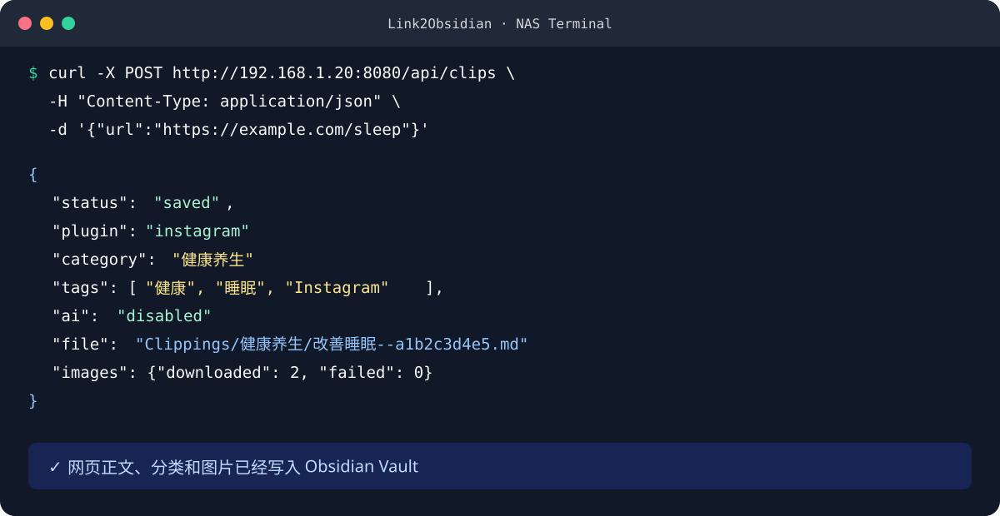
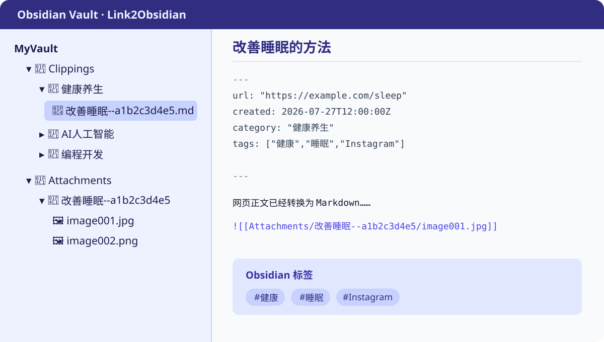

# Link2Obsidian（纳知库）

[English](README_EN.md) · [Docker 部署](docs/docker-deployment.zh-CN.md) · [NAS 安装](docs/nas-installation.zh-CN.md) · [配置说明](docs/configuration.zh-CN.md) · [Roadmap](ROADMAP.md)

Link2Obsidian 是一个运行在 NAS 上的自动化采集工具：

```text
网页链接 → 正文提取 → 图片本地化 → Markdown → Obsidian Vault
```

它不是笔记软件、知识库、阅读器或下载管理器。它只负责把链接可靠地转换成 Obsidian 文件。

> 当前状态：可用 MVP。建议先在局域网中使用；API 鉴权仍在 Roadmap 中。

## 功能

- 使用 Chromium 加载普通网页和动态网页
- 使用 Defuddle 提取标题、来源和正文
- 自动下载正文图片并转换为 Obsidian `![[附件]]`
- 相同 URL 防重复保存，重复图片按内容去重
- 自动生成中文安全文件名
- 按知识主题保存到十个默认目录
- 自动生成主题标签，并保留网站来源标签
- 内置普通网页、Instagram、X（Twitter）适配插件
- 可选 AI 摘要、关键词、分类建议和标签
- 支持 Ollama、本地模型和 OpenAI-compatible 云端 API
- AI 关闭、超时或出错时，基础采集仍然正常工作

## 效果预览





## 三步安装

### 1. 下载项目

```bash
git clone https://github.com/xhui999w/Link2Obsidian.git
cd Link2Obsidian
cp .env.example .env
```

### 2. 设置 Vault 路径

编辑 `.env`：

```env
L2O_VAULT_HOST_PATH=/volume1/Obsidian/MyVault
```

把路径换成 NAS 上真实的 Obsidian Vault 目录。该目录必须允许容器写入。

### 3. 启动

```bash
docker compose up -d --build
```

检查状态：

```bash
curl http://NAS-IP:8080/health
```

更完整的步骤见：

- [Docker 部署教程](docs/docker-deployment.zh-CN.md)
- [群晖、威联通、TrueNAS 安装教程](docs/nas-installation.zh-CN.md)

## 保存第一个链接

```bash
curl -X POST http://NAS-IP:8080/api/clips \
  -H "Content-Type: application/json" \
  -d '{"url":"https://example.com/article"}'
```

成功时返回 HTTP `201`：

```json
{
  "status": "saved",
  "plugin": "general",
  "category": "生活经验",
  "tags": ["生活"],
  "ai": "disabled",
  "title": "文章标题",
  "source": "example.com",
  "url": "https://example.com/article",
  "file": "Clippings/生活经验/文章标题--a1b2c3d4e5.md",
  "images": {
    "downloaded": 2,
    "failed": 0
  }
}
```

重复提交同一 URL 会返回 `"status": "duplicate"`，不会生成第二份文件。

## Vault 输出

```text
MyVault/
├── Clippings/
│   ├── 健康养生/
│   │   └── 改善睡眠--a1b2c3d4e5.md
│   ├── AI人工智能/
│   └── 编程开发/
└── Attachments/
    └── 改善睡眠--a1b2c3d4e5/
        ├── image001.jpg
        └── image002.png
```

Markdown 示例：

```markdown
---
url: "https://example.com/sleep"
created: 2026-07-27T12:00:00.000Z
category: "健康养生"
tags: ["健康","睡眠","Example"]
---

正文内容……

![[Attachments/改善睡眠--a1b2c3d4e5/image001.jpg]]
```

Obsidian 会将标签显示为 `#健康`、`#睡眠`、`#Example`。

## 默认分类

```text
健康养生    运动健康    育儿教育    AI人工智能    科技数码
学习成长    编程开发    商业财经    生活经验      兴趣爱好
```

分类依据是文章标题和正文，不按文章来源分类。网站名称只作为来源标签保留。

## 可选 AI

AI 默认关闭，不影响基础功能。

Ollama 示例：

```env
L2O_AI_ENABLED=true
L2O_AI_PROVIDER=ollama
L2O_AI_BASE_URL=http://host.docker.internal:11434
L2O_AI_MODEL=qwen3:8b
```

AI 可以补充：

- `summary`：摘要
- `keywords`：关键词
- `category`：分类建议
- `tags`：标签

模型不可用时系统自动回退到本地规则分类。详细配置见 [AI 模块说明](docs/ai.md)。

## 常用配置

| 变量 | 默认值 | 说明 |
| --- | --- | --- |
| `L2O_PORT` | `8080` | NAS 对外服务端口 |
| `L2O_VAULT_HOST_PATH` | `./vault` | NAS 上的 Vault 目录 |
| `L2O_OUTPUT_DIR` | `Clippings` | Markdown 根目录 |
| `L2O_ATTACHMENTS_DIR` | `Attachments` | 图片附件目录 |
| `L2O_DEFAULT_CATEGORY` | `生活经验` | 无关键词匹配时的分类 |
| `L2O_MAX_IMAGES` | `100` | 单篇文章最多处理图片数 |
| `L2O_AI_ENABLED` | `false` | 是否启用 AI |

全部配置见 [配置说明](docs/configuration.zh-CN.md)。

## API

| 方法 | 地址 | 说明 |
| --- | --- | --- |
| `GET` | `/` | 服务信息 |
| `GET` | `/health` | 健康状态和 AI 状态 |
| `GET` | `/api/plugins` | 已加载的网站插件 |
| `POST` | `/api/clips` | 提交一个网页链接 |

当前没有管理后台。可以使用 `curl`、iOS 快捷指令、浏览器脚本或其他自动化工具调用 API。

## 支持的网站

- 普通文章网页：通用 Defuddle 提取
- Instagram：支持帖子正文和多图采集
- X（Twitter）：支持帖子正文和图片采集

网站结构变化时，适配规则可以通过 `plugins/<站点>/plugin.json` 更新，无需改动图片和 Markdown 流程。

## 项目边界

Link2Obsidian 不计划加入：

- 笔记编辑器
- 知识库搜索
- 稍后读或阅读进度
- 内容推荐
- 社交功能
- 通用下载管理

项目 Roadmap 只围绕“链接 → Markdown → Obsidian”展开。

## 开发

需要 Node.js 22+：

```bash
npm install
npm run dev
```

验证：

```bash
npm run typecheck
npm test
npm run build
```

## 文档

- [Docker 部署](docs/docker-deployment.zh-CN.md)
- [NAS 安装](docs/nas-installation.zh-CN.md)
- [完整配置](docs/configuration.zh-CN.md)
- [AI 配置](docs/ai.md)
- [主题分类](docs/classification.md)
- [网站插件开发](docs/plugin-development.md)
- [架构说明](docs/architecture.md)
- [贡献指南](CONTRIBUTING.md)
- [Roadmap](ROADMAP.md)

## 参与贡献

欢迎提交网站适配、解析修复、NAS 部署文档和测试用例。提交前请阅读 [CONTRIBUTING.md](CONTRIBUTING.md)。

遇到问题时，请选择对应的 GitHub Issue 模板，并附上 NAS 型号、CPU 架构、Docker 版本、项目日志和发生问题的网页类型。

## License

[MIT](LICENSE)
